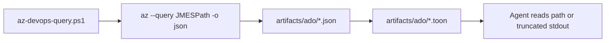
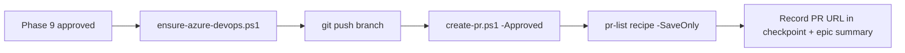

# azure-devops-cli

Deterministic **Azure DevOps** integration using the official **Azure CLI** with the
`azure-devops` extension (`az repos`, `az pipelines`, `az boards`, `az devops`). Reads
`pipeline.manifest.json` `pr.*` for organization, project, repository, and target branch.

**Not** Azure Resource Manager (`az group`, `az vm`) — only Azure DevOps services.

## Prerequisites

| Tool | Install |
|------|---------|
| Azure CLI | https://learn.microsoft.com/cli/azure/install-azure-cli |
| `azure-devops` extension | `az extension add --name azure-devops` (or use script below) |

### Authentication

Azure DevOps CLI uses a **Personal Access Token (PAT)** — not the same session as `az login`
for Azure Resource Manager. Create a PAT in Azure DevOps:

**User settings → Personal access tokens → New token**

| Scope (minimum) | Used for |
|-----------------|----------|
| **Code** (Read & write) | `az repos` — PRs, branches |
| **Work Items** (Read & write) | `az boards` — work items |
| **Build** (Read) | `az pipelines` — list runs, status |

Set expiration as your org policy allows. Never commit the PAT.

#### Option A — environment variable (CI / scripts)

```bash
export AZURE_DEVOPS_EXT_PAT="your-pat-here"
```

`ensure-azure-devops.ps1` and all skill scripts pick this up automatically.

#### Option B — macOS Keychain (recommended for local dev)

Store the PAT once in Keychain, then load it into the env var before `az devops login`:

```bash
# One-time: save PAT to Keychain (replace with your token)
security add-generic-password -a "$USER" -s AZDO_PAT -w "your-pat-here" -U

# Update existing entry
security add-generic-password -a "$USER" -s AZDO_PAT -w "new-pat" -U
```

Add to `~/.zshrc` (set `AZDO_ORG` to match `pipeline.manifest.json` `pr.org`):

```bash
azdo-login() {
  export AZURE_DEVOPS_EXT_PAT="$(security find-generic-password -s AZDO_PAT -w)"
  az devops login --organization "https://dev.azure.com/${AZDO_ORG:-petrovskyitools}"
}
```

Usage:

```bash
export AZDO_ORG=petrovskyitools   # or your org slug
azdo-login
pwsh .cursor/skills/azure-devops-cli/scripts/ensure-azure-devops.ps1
```

`az devops login` reads `AZURE_DEVOPS_EXT_PAT` from the environment — the function sets both.

#### Option C — interactive pipe (quick test)

```bash
echo "$AZURE_DEVOPS_EXT_PAT" | az devops login --organization https://dev.azure.com/my-org
```

#### Verify auth

```powershell
pwsh .cursor/skills/azure-devops-cli/scripts/ensure-azure-devops.ps1 -Json
pwsh .cursor/skills/azure-devops-cli/scripts/configure-azure-devops.ps1
```

| Context | Method |
|---------|--------|
| macOS local | Keychain + `azdo-login` → `AZURE_DEVOPS_EXT_PAT` |
| Linux / WSL | `export AZURE_DEVOPS_EXT_PAT=...` or secret manager |
| CI / agent | Pipeline secret → `AZURE_DEVOPS_EXT_PAT` env var |
| Azure RM resources | Separate: `az login` (not used for DevOps CLI in this skill) |

## Manifest configuration

Set in `pipeline.manifest.json`:

```json
"pr": {
  "type": "azure-devops",
  "org": "my-org",
  "project": "MyProject",
  "repo": "MyRepo",
  "target_branch": "main",
  "branch_prefix": { "feature": "feature/", "fix": "fix/", "chore": "chore/" }
}
```

- `org` — organization name or full URL (`https://dev.azure.com/my-org`)
- `project` — Azure DevOps project name
- `repo` — Git repository name (for `az repos pr create`)

## Commands

```powershell
$ADO = '.cursor/skills/azure-devops-cli/scripts'

# 1. Verify CLI + extension + auth (+ optional install extension)
pwsh $ADO/ensure-azure-devops.ps1 -InstallExtension

# 2. Apply manifest defaults to az devops configure
pwsh $ADO/configure-azure-devops.ps1

# 3. Mutating passthrough — org/project injected automatically
pwsh $ADO/az-devops.ps1 pipelines run --name "CI" --branch main
pwsh $ADO/az-devops.ps1 boards work-item create --title "Implement REQ-0006" --type Task

# 4. Read queries — JSON source + TOON projection (token-efficient)
$Q = "$ADO/az-devops-query.ps1"
pwsh $Q -ListRecipes
pwsh $Q -Recipe pr-list -Session 20260610-my-feature -Stats
pwsh $Q -Recipe pr-show -Vars @{ id = 42 } -SaveOnly
pwsh $Q -Recipe pipeline-runs -Vars @{ pipelineId = 12; top = 5 }
pwsh $Q repos pipelines list --top 3   # freeform passthrough

# 5. Phase 10 — create PR (ONLY after Phase 9 human approval)
pwsh $ADO/create-pr.ps1 `
  -SourceBranch feature/REQ-0006-my-feature `
  -Title "feat(REQ-0006): My feature" `
  -DescriptionFile docs/sdlc/closeout/REQ-0006-summary.md `
  -Push -Approved `
  -OutputJson _code_agent/pr-result.json
```

## Pipeline placement

| Phase | Agent | Azure DevOps responsibility |
|-------|-------|----------------------------|
| **6** | `team-lead` (+ `devops`) | Link plan tasks to ADO work items when tracker maps to boards |
| **7** | `devops` | Pipeline YAML changes; trigger validation builds via `az pipelines` |
| **10** | `coordinator` | **PR creation** via `create-pr.ps1` after human approval |

**Coordinator rule:** never pass `-Approved` or `-Push` until Phase 9 gate passes.

## TOON query workflow (token-efficient reads)

Read-only Azure DevOps data uses **JSON source + TOON projection** (same pattern as
`checkpoint` skill):



| Step | What |
|------|------|
| 1 | `az --query` drops unused fields (JMESPath) |
| 2 | Shaped JSON saved as source of truth |
| 3 | `agentic-tool toon encode` (or Python fallback) writes `.toon` |
| 4 | Agent cites **paths** in chat — not full TOON bodies |

### Query flags

| Flag | Behavior |
|------|----------|
| `-Recipe {id}` | Named query from `catalog/recipes.json` |
| `-Vars @{ ... }` | Template variables for recipe |
| `-Session {code}` | Write under `_code_agent/{session}/artifacts/ado/` |
| `-SaveOnly` | Index line only (path + bytes) |
| `-PrintToon` (default) | Also print TOON to stdout |
| `-MaxChars N` | Truncate stdout; full content in file |
| `-Stats` | Print JSON vs TOON token estimate |
| `-ListRecipes` | TOON table of available recipes |

### Recipe catalog

See [`catalog/README.md`](catalog/README.md). Recipes: `pr-list`, `pr-show`, `pipeline-list`,
`pipeline-runs`, `pipeline-run-show`, `work-item-show`, `work-item-query`, `repo-list`.

### TOON encoders (priority order)

1. **`agentic-tool toon encode --stdin`** — Cysharp ToonEncoder (same as checkpoints)
2. **`json-to-toon.py`** — Python fallback: `pip install 'toon-format==0.9.0b1'`

Standalone encode:

```powershell
agentic-tool toon encode --file data.json --stats
echo '{"items":[1,2,3]}' | agentic-tool toon encode --stdin
python3 .cursor/skills/azure-devops-cli/scripts/json-to-toon.py --stdin --stats
```

### Token savings (measured)

Run `pwsh scripts/bench-toon.ps1` to reproduce. Samples in `catalog/samples/`.

| Shape | JSON tokens | TOON tokens | Saved |
|-------|-------------|-------------|-------|
| PR list (10 rows, shaped via `--query`) | 530 | 369 | **30%** |
| PR list (10 rows, raw nested `az` output) | 1036 | 1114 | **-7%** (worse) |
| Pipeline runs (2 rows, shaped) | 93 | 74 | **20%** |

**Key insight:** JMESPath shaping before TOON is required. Raw nested JSON can cost *more* tokens as TOON.
Always use `-Recipe` or `--query` projection.

## Common operations

### Repos (pull requests, branches)

```powershell
pwsh $Q -Recipe pr-list -Session $SESSION -SaveOnly
pwsh $Q -Recipe pr-show -Vars @{ id = 42 }
pwsh $ADO/az-devops.ps1 repos ref list --filter heads/
```

### Pipelines (CI/CD)

```powershell
pwsh $Q -Recipe pipeline-list
pwsh $Q -Recipe pipeline-runs -Vars @{ pipelineId = 12; top = 5 }
pwsh $ADO/az-devops.ps1 pipelines run --id 12 --branch feature/REQ-0006-slug
```

### Boards (work items)

```powershell
pwsh $Q -Recipe work-item-show -Vars @{ id = 12345 }
pwsh $ADO/az-devops.ps1 boards work-item create --title "Implement REQ-0006" --type Task
pwsh $ADO/az-devops.ps1 boards work-item update --id 12345 --state "Active"
```

Link work items to a PR with `create-pr.ps1 -WorkItems 12345,12346`.

## Phase 10 closeout flow



1. Human approves Phase 9 closeout.
2. Run `ensure-azure-devops.ps1` — must PASS.
3. `create-pr.ps1 -Push -Approved` — pushes branch and opens PR.
4. Record returned URL in session artifacts and epic summary.

## Outputs

| File | Purpose |
|------|---------|
| `_code_agent/{session}/artifacts/ado/*.json` | Shaped query JSON (source of truth) |
| `_code_agent/{session}/artifacts/ado/*.toon` | Token-efficient LLM view |
| `_code_agent/pr-result.json` | Machine-readable PR result (optional `-OutputJson`) |
| PR URL (stdout) | Paste into closeout summary |

### `pr-result.json` shape

```json
{
  "schemaVersion": "1",
  "provider": "azure-devops",
  "pullRequestId": 42,
  "url": "https://dev.azure.com/org/project/_git/repo/pullrequest/42",
  "sourceBranch": "feature/REQ-0006-slug",
  "targetBranch": "main"
}
```

## MCP vs CLI vs TOON

| Situation | Use |
|-----------|-----|
| Interactive exploration in Cursor | Azure DevOps **MCP** |
| Scripted read queries + token savings | **`az-devops-query.ps1`** + TOON files |
| PR creation, pipeline run (mutating) | **`az-devops.ps1`** / `create-pr.ps1` |
| Manifest-driven org/project defaults | This skill (all scripts) |
| Environments without MCP | CLI + TOON query layer |

MCP responses are already structured; the TOON layer targets **CLI JSON** specifically.

## Constraints

- Never commit PATs or print `AZURE_DEVOPS_EXT_PAT` / Keychain values.
- Never create or push PRs before Phase 9 approval.
- Cite artifact **paths** and PR URLs in chat — not full `az` JSON or TOON dumps.
- English for PR titles and descriptions.

## Resources

- Extension docs: https://learn.microsoft.com/azure/devops/cli
- Recipe catalog: `catalog/README.md`
- macOS login helper: `templates/azdo-login-macos.zsh`
- Pipeline spec Phase 10: package `docs/reference/pipeline-spec.md`
- Test results for ADO pipelines: `dotnet-unit-tests` skill → `TestResults/azure-devops-results.json`
