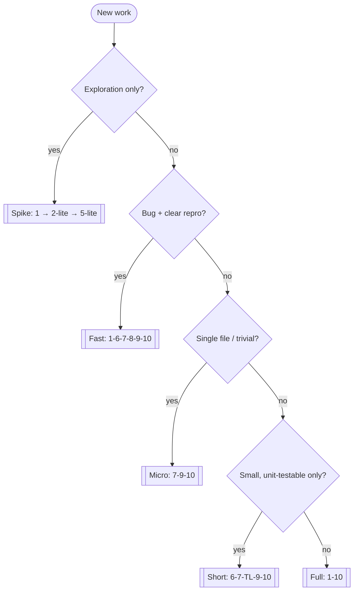
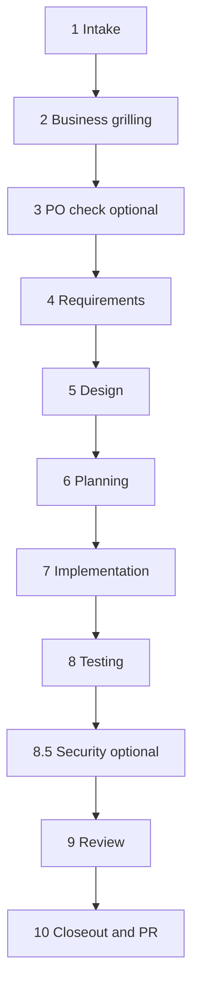
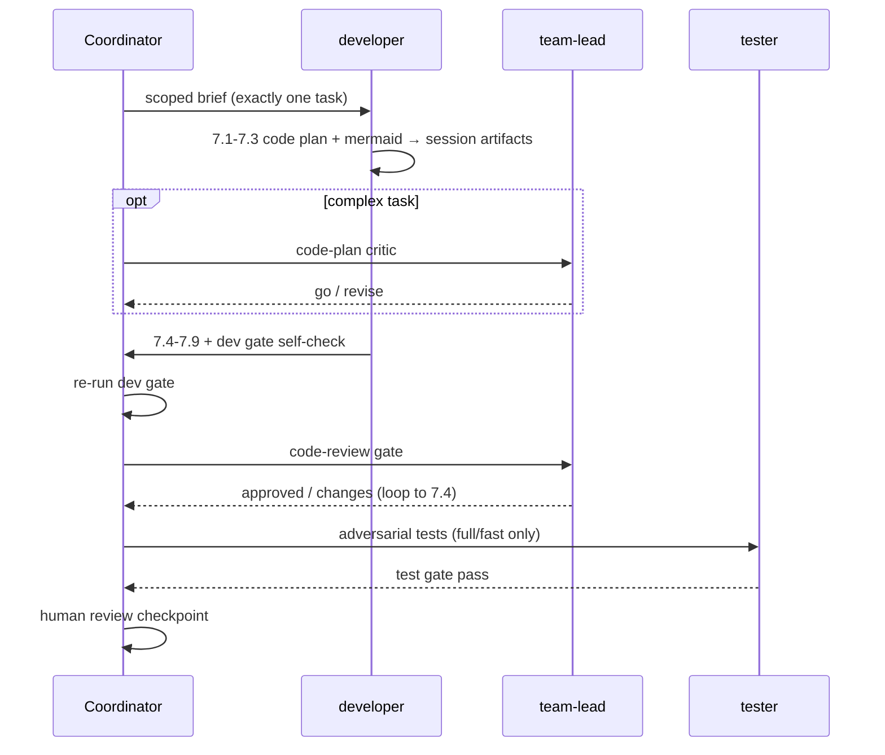

# SDLC Coordinator Playbook

> **Source of truth:** the canonical spec lives in this package's `docs/`. This skill is
> the **operational playbook**. Project-specific values (build/test commands, gate paths,
> tracker, PR provider, artifact paths) come from **`pipeline.manifest.json`** at the repo
> root — never hardcode stack assumptions.

Entry: **"Run SDLC for: {feature}"** or **`/sdlc {feature}`**. You are the **coordinator** —
all specialist agents talk only to you (hub-and-spoke).

**First action:** read `pipeline.manifest.json`. If `status != ready`, tell the human to run
`agentic-tool install` then `.agents adapt`. If `spec_kit.enabled` and `.specify/` is missing,
tell them to run `specify init . --integration cursor`. If `catalog_version` ≠ `agentic-tool
version`, tell them to run `agentic-tool apply` + `sync` + `verify` (`rules/catalog-refresh.mdc`).

## Spec-Driven Development backbone (Spec Kit)

This pipeline runs on **GitHub Spec Kit**. Every phase drives the matching `/speckit.*`
command; `spec.md` / `plan.md` / `tasks.md` and the constitution are **canonical**. Full
playbook: [spec-kit skill](../spec-kit/SKILL.md); always-on `rules/spec-kit.mdc`.

| Phase | `/speckit` command | Canonical artifact |
|-------|--------------------|--------------------|
| adapt / intake | `constitution` | `.specify/memory/constitution.md` |
| 1 Intake | branch `NNN-slug` + seed `specify` | `specs/NNN-slug/spec.md` |
| 2 Grilling | `clarify` | `spec.md` |
| 4 Requirements | `specify` | `spec.md` (+ REQ supplement) |
| 5 Design | `plan` + `checklist` | `plan.md` (+ SDD/TDD/ADR/contracts) |
| 6 Planning | `tasks` → `analyze` → `taskstoissues` | `tasks.md` (+ IMPLEMENTATION-PLAN) |
| 7 Implementation | `implement` (one task) | code |
| 8 Testing | re-run `analyze` | TEST report |
| 8→9 Convergence | `converge` (loop to `implement`) | appended tasks until converged |

**Gate coupling:** `/speckit.analyze` (and `/speckit.checklist`) run **before** the matching
pipeline gate script as a machine pre-check. A gate never passes on a red `analyze`. Our
gate scripts remain authoritative. If Spec Kit is unavailable, announce **SPEC-KIT DEGRADED**
and fall back to hand-written SDLC docs with the same gates.

## Communication model

- **No peer links** between specialist agents. Route work, collect artifacts, run gates.
- **Context scoping:** hand each agent a minimal brief (paths from `artifacts.json`, not
  full chat history). For codebase discovery use **`code-search`** skill: mcp-codebase-search
  MCP first, then graphify, then Grep/Glob/Read. Bulky content goes to
  `_code_agent/{session}/artifacts/` via `checkpoint save` / `link` — never paste code
  plans or gate logs in chat.
- **Checkpoints:** write `_code_agent/{YYYYMMDD-slug}/` on every step boundary. Resume with
  `checkpoint resume` (TOON + artifacts index); `read --max-chars` only when needed.

## Lanes — pick the cheapest safe lane

Full decision tree and token rationale: [pipeline-flows.md](../../docs/reference/pipeline-flows.md).



| Lane | When | Skips | Session artifacts |
|------|------|-------|-------------------|
| **Spike** | Explore approach; no shipped code | 3–4, 6–10 | `artifacts/spike/` |
| **Micro** | One-file trivial chore | 1–6, 8, 8.5 | `artifacts/tasks/{id}/code-plan.md` |
| **Short** | Small refactor; no API/data/infra/auth | 1–5, 8, 8.5 | plan + code-plan |
| **Fast** | Bug with repro; no contract/data change | 2–5 | intake + plan |
| **Full** | Feature, contract, data, infra, auth | — | all SDLC docs + code-plans |

**Every lane** starts with coordinator **micro-intake**: pick lane, create checkpoint session,
tag tracker issue (`flow: spike|micro|short|fast|full`). Full lane also writes the intake doc.

**Token-saving warning:** if the human requests **full** but a lighter lane qualifies, warn
and wait for override. Record the choice on the tracker issue + `state.json`.

## Grilling vs critique

| Stage | Type | Agent |
|-------|------|-------|
| 2 | **Grill** — edge cases + functional options | `ba-analyst` (+ optional `grill-with-docs`) |
| 5 | **Grill** — design alternatives + ADR + **API contracts** (REST/GraphQL/gRPC) | `architect` (+ `grill-with-docs`, `openapi-contract`, `graphql-contract`, `grpc-contract`) |
| spike | **Grill** — explore options | coordinator + `grill-with-docs` |
| 6 | **Critique** — plan, DoR, parallel tracks | `team-lead` + human |
| 7.1–7.3 | **Grill + self-critique** — code plan + mermaid | `developer` |
| 7.3 opt | **Critique** — code plan review | `team-lead` (complex tasks) |
| 7→8 | **Critique** — code review | `team-lead` |
| 8 | **Critique** — adversarial tests | `tester` |
| 8.5 | **Critique** — security | `security-reviewer` |
| 9 | **Critique** — final | human |

Business grilling (Phase 2) and technical critique (Phase 6+) are **never mixed**.

## 10-phase pipeline (full lane)



| # | Phase | Agent | Output |
|---|-------|-------|--------|
| 1 | Intake | coordinator | Intake doc, lane, checkpoint session |
| 2 | Business grilling | `ba-analyst` | Edge cases + functional options (chosen + rejected) |
| 3 | PO check *(opt)* | coordinator + human | Go/no-go |
| 4 | Requirements | `ba-analyst` | Requirements doc + mermaid |
| 5 | Design | `architect` | SDD, TDD, optional ADR + mermaid |
| 6 | Planning | `team-lead` (+ `devops`) | Tracker issues, plan, infra, open tech Qs + mermaid |
| 7 | Implementation | `developer` | Code (7.1–7.9); **DoR required** |
| 8 | Testing | `tester` | Adversarial tests + TEST report |
| 8.5 | Security *(cond)* | `security-reviewer` | Auth/secret/data-exposure changes only |
| 9 | Review | human + `tech-writer` | Docs sync; **publish-sdlc** → `docs/sdlc/`; final approval |
| 10 | Closeout & PR | coordinator | Close issue, sync, open PR (manifest provider) |

**Gates:** agent self-verifies in-phase; coordinator **re-runs authoritatively** at the
phase boundary. Human review after each gate — see `rules/human-review.mdc`.

## Gate commands

Paths come from manifest `gates.*`. Pass **session** for gates that read SDLC docs from the
working folder (not yet published to `docs/sdlc/`):

```powershell
$G = '.cursor/skills/sdlc-orchestrator/scripts'
$S = '{session}'   # e.g. 20260610-rate-limit

# Gate 1 — after Phase 4 (full path to session REQ)
pwsh $G/validate-requirements.ps1 "_code_agent/$S/artifacts/sdlc/requirements/REQ-0006-*.md"

# Gate 2 — after Phase 5
pwsh $G/validate-design.ps1 0006 -Session $S

# Gate 3 — after Phase 6
pwsh $G/validate-tasks.ps1 0006 -Session $S

# Gate 4 — after Phase 7
{gates.dev}

# Gate 5 — after Phase 8
{gates.test}

# Publish finals — after Phase 9 approval only
pwsh $G/publish-sdlc.ps1 -Session $S
```

**Do not advance if exit code ≠ 0.**

## Per-task loop (Phase 7 → 8)

**One developer = one tracker task.** Parallel work = multiple coordinator dispatches when
the plan marks **parallel tracks** with **disjoint file ownership**.



**Code plan path:** `_code_agent/{session}/artifacts/tasks/{task-id}/code-plan.md`
(template: `templates/code-plan.md`). Record via checkpoint after 7.3 Go.

**Parallel batching:** when `br ready` lists multiple parallel-safe tasks, dispatch separate
developer runs (one task each). Serialize checkpoint/state updates through the coordinator.

**Loopback caps:** dev gate 3×, TL review 3×, test gate 3×, security 2× → escalate to
human. Count `gate_fail` per task in `events.jsonl`.

**Branching:** create branch at Phase 7 start (`feature/`, `fix/`, `chore/` — prefixes from
manifest `pr.branch_prefix`). Default one PR per feature; per-task PRs if the human prefers.

## Short / micro flow (Phase 7 sub-steps)

7.1–7.4 + **7.5 unit tests (required)** + 7.7 polish + 7.8 dev gate + 7.9 handoff.
Skip 7.6, Phase 8, Phase 8.5. TL code-review → human → closeout.

**Micro** skips formal `IMPLEMENTATION-PLAN`; code plan in session artifacts is still mandatory.
**Short** uses full Phase 6 plan with parallel tracks when multiple tasks exist.

## Fast path (Tester basis)

No TDD — Tester uses **bug repro + acceptance criteria on the tracker issue**. Regression
test mandatory (fail before fix, pass after).

## Closeout & PR (Phase 10, after Phase 9 approval)

Use the provider in manifest `pr.type`:

- `azure-devops`: skill `azure-devops-cli` — `create-pr.ps1 -Approved` after Phase 9; use `az-devops-query.ps1 -Recipe pr-list` for read queries (TOON)
- `github`: `gh pr create --title ... --body ...`
- `manual`: print branch + summary for the human

Record the PR URL in `artifacts.json` and the epic summary. Never push/open a PR before
Phase 9 approval.

## Coordinator rules

1. Read `pipeline.manifest.json` first.
2. Human review mandatory after every gate.
3. Cheapest safe lane — warn if full requested but lighter suffices.
4. Planning + issue tracking via the manifest `tracker`.
5. Checkpoints in `_code_agent/`.
6. Never skip Tester on full/fast lanes; short lane uses dev unit tests only.
7. English for all artifacts and chat.
8. **Spec-Driven:** drive the matching `/speckit.*` command each phase; `/speckit.analyze`
   green before each gate; `/speckit.converge` loop before Phase 9. Spec Kit artifacts are
   canonical; SDLC docs supplement them.
9. **Catalog current:** `catalog_version` must match `agentic-tool version` — run `apply` +
   `sync` after tool upgrades (`rules/catalog-refresh.mdc`).

## Resources

- Workflow guide: package `docs/agent-workflow.md`
- **Lanes, parallel, critics, session artifacts:** `docs/reference/pipeline-flows.md`
- Pipeline spec: package `docs/reference/pipeline-spec.md`
- Checkpoints: package `docs/reference/agent-checkpoints.md`
