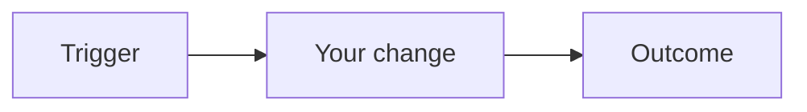
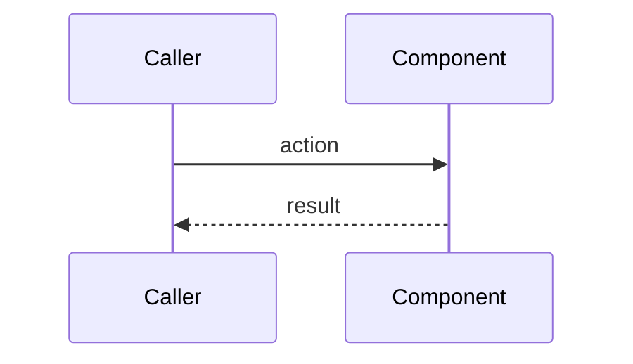

# Code Plan — {task-id}: {title}

**Session:** `{session_code}`
**Task:** `{task-id}`
**REQ / SDD / TDD:** REQ-NNNN / SDD-NNNN / TDD-NNNN
**Agent:** developer (steps 7.1–7.3)

## Goal

{One paragraph — what this task achieves against its acceptance criteria.}

## Approach

{How you will implement it — no full code, just the strategy.}

## File map

| Path | Action | Why |
|------|--------|-----|
| `src/...` | add / modify / delete | {reason} |

## OpenAPI (if REST API task)

| operationId | Method / path | Schema refs | AC covered |
|-------------|---------------|-------------|------------|
| `{operationId}` | GET `/api/...` | `PackageDto` | AC-3 |

## GraphQL (if GraphQL task)

| Field | Root | Types | AC covered |
|-------|------|-------|------------|
| `package` | Query | `Package` | AC-3 |

## gRPC (if gRPC task)

| RPC | Request | Response | AC covered |
|-----|---------|----------|------------|
| `GetPackage` | `GetPackageRequest` | `Package` | AC-3 |

Contract paths: `artifacts.openapi` / `artifacts.graphql` / `artifacts.grpc_proto`

## Mermaid — change flow

## Mermaid — sequence (if interaction)

## Solution check (7.3)

- [ ] Every acceptance criterion covered by the file map
- [ ] No scope creep — out-of-scope work → new tracker issue
- [ ] Build command will succeed after 7.4
- [ ] **Go** / **Revise** (loop to 7.1 if revise)

## Risks / open points

{Anything blocking 7.4 — escalate to coordinator if blocking.}
