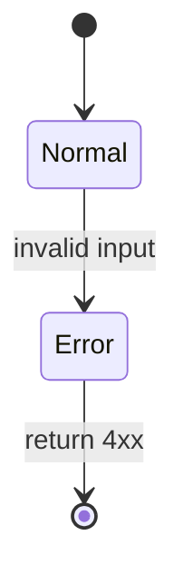

# Edge cases & functional options — REQ-NNNN

Phase 2 (business grilling). Business/behavioral only — no technical implementation choices.

## Edge cases

| ID | Scenario | Expected behavior | Status |
|----|----------|-------------------|--------|
| EC-1 | {e.g. empty input} | {behavior} | decided / deferred |

## Functional options (chosen + rejected)

For each capability with multiple valid behaviors, list all options and record the decision.

### {Capability name}

| Option | Trade-offs | Decision |
|--------|------------|----------|
| A: {e.g. reject 409} | {pros/cons} | **chosen** / rejected |
| B: {e.g. overwrite} | {pros/cons} | rejected |

## Mermaid — edge-case state (optional)

## Open business questions (blocking)

- [ ] {question}

## Deferred (non-blocking)

- {item} — reason: {why}
