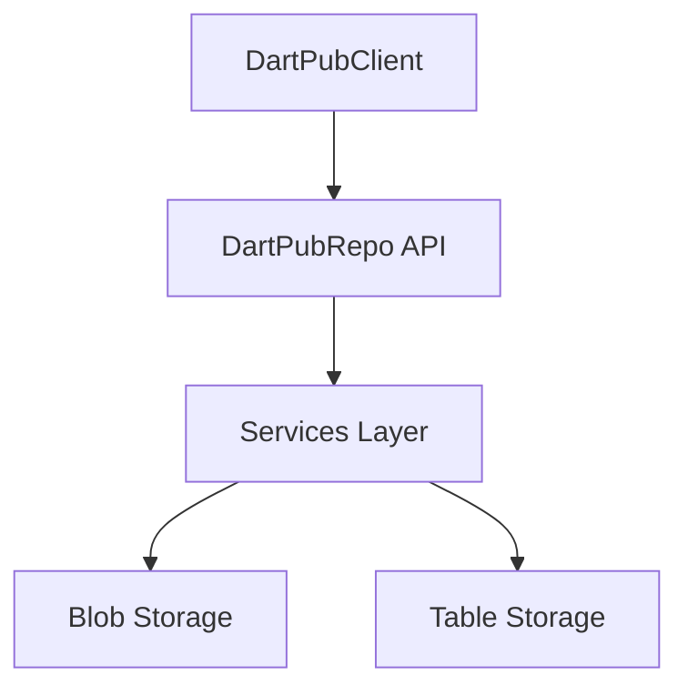

# SDD-NNNN: {Feature Name}

## Meta

| Field | Value |
|-------|-------|
| **ID** | SDD-NNNN |
| **Parent REQ** | REQ-NNNN |
| **Status** | Draft |
| **Author** | {name} |
| **Created** | YYYY-MM-DD |

## 1. Overview

{Brief description}

## 2. Goals and Non-Goals

### Goals

- {goal}

### Non-Goals

- {item explicitly out of scope}

## 3. Architecture Overview

## 4. API Design

| Method | Endpoint | Auth | Description |
|--------|----------|------|-------------|
| GET | /api/packages/{package} | Optional | {description} |

**OpenAPI contract:** complete `docs/sdlc/api/OAPI-NNNN-{slug}.yaml` using skill
`openapi-contract` (this table is the summary; YAML is the authoritative schema).

## 4b. GraphQL API Design

| Field | Type | Auth | Description |
|-------|------|------|-------------|
| `package` | `Query` | Optional | {description} |

**GraphQL contract:** complete `docs/sdlc/api/GQL-NNNN-{slug}.graphql` using skill
`graphql-contract`.

## 4c. gRPC API Design

| RPC | Request | Response | Auth | Description |
|-----|---------|----------|------|-------------|
| `GetPackage` | `GetPackageRequest` | `Package` | mTLS | {description} |

**gRPC contract:** complete `docs/sdlc/api/GRPC-NNNN-{slug}.proto` using skill
`grpc-contract`.

## 5. Data Model

{Entities, relationships, storage tables}

## 6. Design Alternatives

### Alternative A: {Name}

| | |
|---|---|
| **Pros** | {list} |
| **Cons** | {list} |
| **Consequences** | {list} |
| **Estimate** | {time} |

### Alternative B: {Name}

| | |
|---|---|
| **Pros** | {list} |
| **Cons** | {list} |
| **Consequences** | {list} |
| **Estimate** | {time} |

## 7. Recommended Approach

{Chosen alternative with rationale}

## 8. Security Considerations

{Auth, token handling, data protection}

## 9. Performance and Scalability

{Expected load, caching, scaling}

## 10. Observability

{Logging, metrics, tracing}

## 11. Migration Impact

| Target | Impact | Notes |
|--------|--------|-------|
| Minimal API | Low/Med/High | {notes} |
| Native AOT | Low/Med/High | {notes} |
| Docker Buildx | Low/Med/High | {notes} |
| Helm | Low/Med/High | {notes} |

## 12. Open Questions

- {unresolved item}
