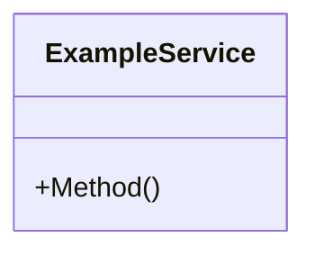
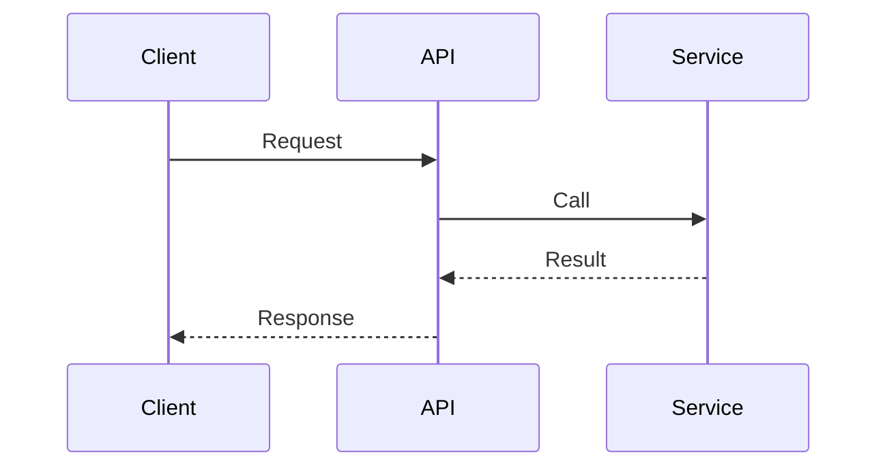

# TDD-NNNN: {Component Name}

## Meta

| Field | Value |
|-------|-------|
| **ID** | TDD-NNNN |
| **Parent SDD** | SDD-NNNN |
| **Parent REQ** | REQ-NNNN |
| **Status** | Draft |
| **Author** | {name} |
| **Created** | YYYY-MM-DD |

## 1. Overview

{What specific component or module is being designed}

## 2. Component Diagram

## 3. Sequence Diagrams

### {Flow Name}

## 4. Interface Contracts

### Input

{Detailed input specifications}

### Output

{Detailed output specifications}

### Error Handling

| Condition | Response | HTTP Status |
|-----------|----------|-------------|
| {condition} | {response} | {code} |

## 5. Implementation Steps

| Step | Description | Estimate |
|------|-------------|----------|
| 1 | {step} | {time} |

## 6. Testing Strategy

### Unit Tests

- {scenario}

### Integration Tests

- {scenario}

### Edge Cases

- {case}

## 7. Rollback Plan

{How to revert if issues are found}
