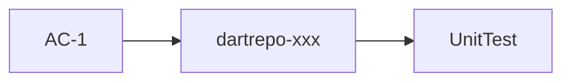

# Traceability matrix — REQ-NNNN

Maps every acceptance criterion → beads task → test(s). Checked at Phase 8 test gate.

| AC ID | Acceptance criterion | Task (br id) | Test(s) | Status |
|-------|---------------------|--------------|---------|--------|
| AC-1 | {from REQ} | dartrepo-xxx | `TestClass.Method_Scenario_Result` | covered / pending |

## Orphan check

- [ ] No acceptance criterion without a task
- [ ] No acceptance criterion without at least one test
- [ ] No test without a mapped AC

## Mermaid — coverage overview (optional)

